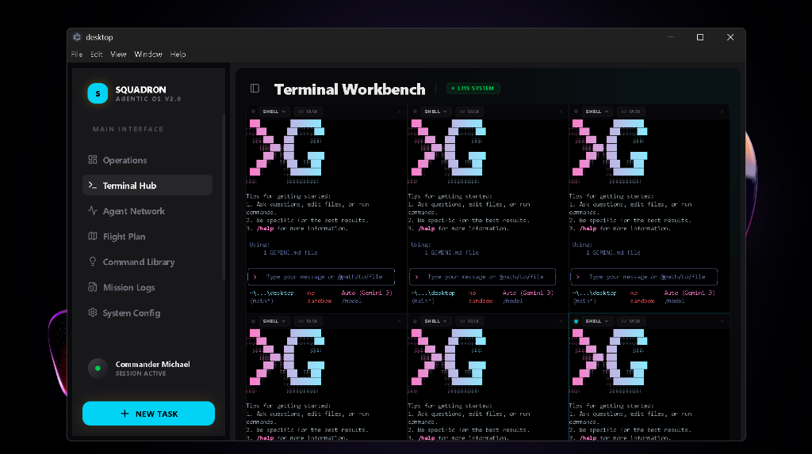
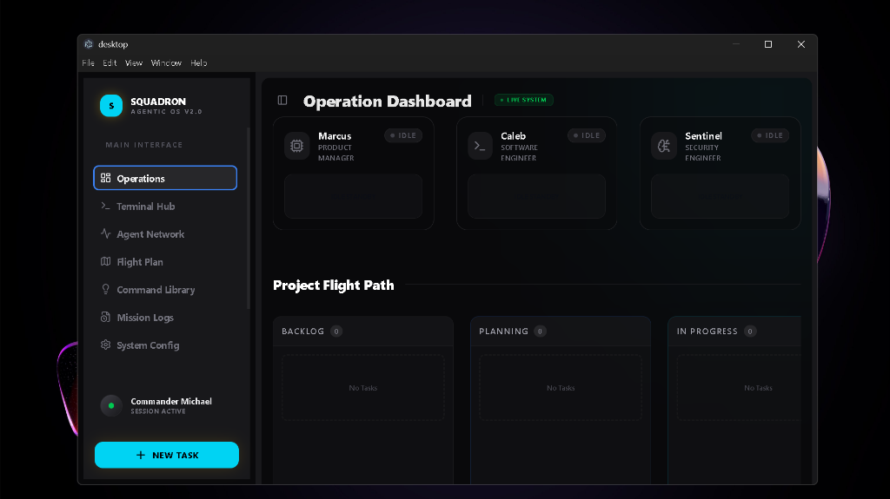
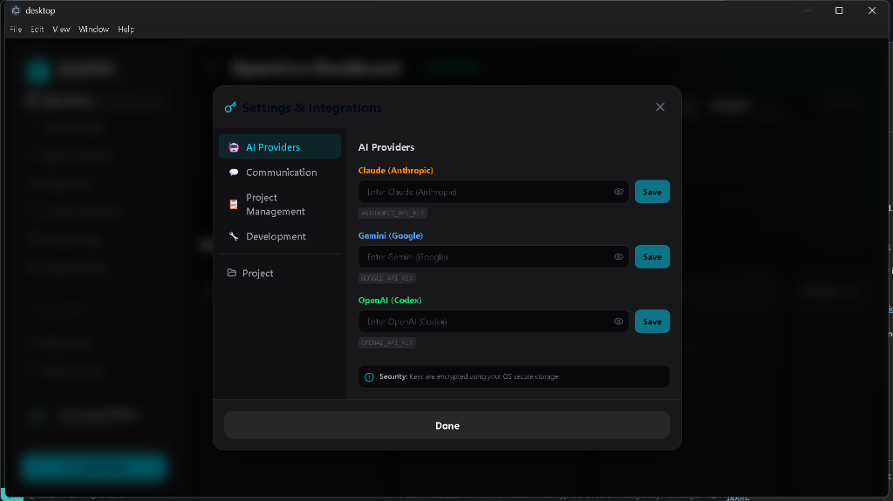
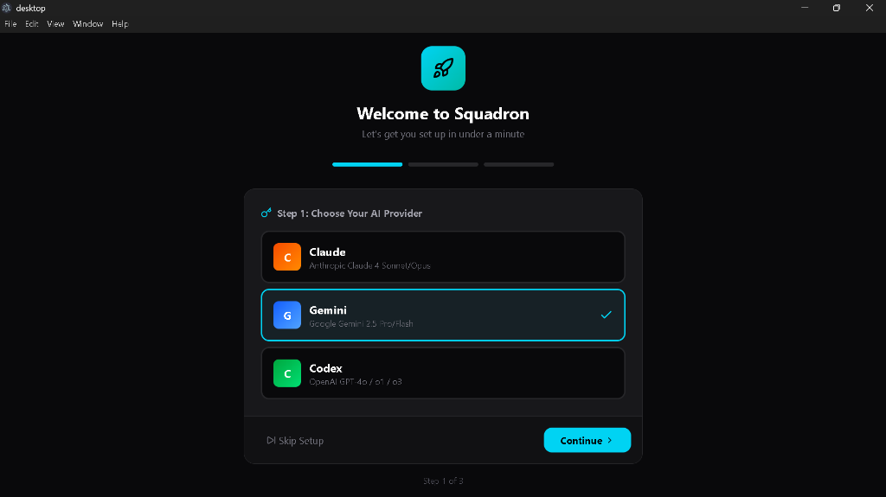

<div align="center">
  <a href="https://github.com/MikeeBuilds/Squadron">
    
  </a>

  <h1>Squadron</h1>

  <p>
    <strong>The Agentic Operating System for Your Desktop</strong>
  </p>

  <p>
    Squadron is a native command center that lets you manage swarms of local AI agents (Gemini, Claude, Codex) as if they were employees.<br/>
    Features a 6-terminal parallel workbench, Kanban task management, and deep integration with Jira/Linear to turn AI autonomy into real engineering work.
  </p>

  <br/>

  <p>
    <a href="https://github.com/MikeeBuilds/Squadron/releases/latest"><strong>⬇️ Download Now</strong></a>
    &nbsp;&nbsp;•&nbsp;&nbsp;
    <a href="#-features">Features</a>
    &nbsp;&nbsp;•&nbsp;&nbsp;
    <a href="#-quick-start">Quick Start</a>
    &nbsp;&nbsp;•&nbsp;&nbsp;
    <a href="#-architecture">Architecture</a>
  </p>
</div>

<p align="center">
  <a href="https://github.com/MikeeBuilds/Squadron/releases"></a>
  <a href="https://github.com/MikeeBuilds/Squadron/releases"></a>
  <a href="https://www.gnu.org/licenses/agpl-3.0"></a>
</p>

<p align="center">
  
</p>

---

## 🔥 What's New in v2.0

| Feature | Description |
|:---|:---|
| **🖥️ Native Desktop App** | Download and run — no terminal required |
| **🤖 Multi-Provider Support** | Claude, Gemini, Codex, OpenCode, Cursor |
| **📺 6-Terminal Grid** | Run 6 AI agents simultaneously |
| **🔐 Secure API Keys** | Encrypted storage with OS-level security |
| **🌳 Git Worktrees** | Safe parallel execution per task |
| **📋 Kanban Board** | Drag-and-drop task management |
| **🚀 Onboarding Wizard** | Get started in under a minute |

---

## ⬇️ Download

Download the latest release for your platform:

| Platform | Download | Architecture |
|----------|----------|--------------|
| **Windows** | [Squadron-Setup.exe](https://github.com/MikeeBuilds/Squadron/releases/latest) | x64 |
| **macOS** | *Coming Soon* | Intel & Apple Silicon |
| **Linux** | *Coming Soon* | x64 |

> **Windows users**: You may see a SmartScreen warning. Click "More info" → "Run anyway". We're working on code signing.

---

## ✨ Features

### 🤖 Multi-Provider AI Terminal

Run any AI coding assistant directly in Squadron:

| Provider | Models | Status |
|----------|--------|--------|
| **Claude** | Sonnet 4, Opus 4, Haiku | ✅ Auto-install |
| **Gemini** | 2.5 Pro, 2.5 Flash | ✅ Auto-install |
| **OpenAI Codex** | GPT-4o, o1, o3-mini | ✅ Auto-install |
| **OpenCode** | Multi-model | ✅ Auto-install |
| **Cursor** | Any model | ✅ Auto-install |

> **Auto-Install**: CLIs download automatically when you select a provider. No manual setup.

### 📺 6-Terminal Grid

<p align="center">
  
</p>

- **3x2 Grid Layout** — See all agents at once
- **Per-Terminal Provider** — Run Claude in one, Gemini in another
- **Task Linking** — Connect terminals to Kanban tasks
- **Context Injection** — Task details auto-sent to AI

### 📋 Kanban Board

<p align="center">
  
</p>

Visual task management:
- **Columns**: Backlog → Planning → In Progress → Review → Done
- **Real-time Updates** via Server-Sent Events
- **Task Wizard** for quick task creation
- **Agent Assignment** per task

### 🌳 Git Worktree Isolation

Each agent task gets its own isolated workspace:

```
Task Started → .worktrees/task-XXX created → Agent works in isolation
                                                    ↓
                                        Merge or Discard via Dashboard
```

**Benefits:**
- ✅ Agents work in parallel without conflicts
- ✅ Main branch stays protected
- ✅ Easy to discard failed work
- ✅ Each task gets its own branch for review

### 🔐 Secure Settings

<p align="center">
  
</p>

- **Encrypted at Rest** using OS-level security (Windows DPAPI / macOS Keychain)
- **11 Integrations**: Slack, Discord, Jira, Linear, GitHub + AI providers
- **Export to .env** for Python backend
- **Never Transmitted** — keys stay local

---

## 🚀 Quick Start

### 1. Download & Install

Download from [Releases](https://github.com/MikeeBuilds/Squadron/releases/latest) and install for your platform.

### 2. Complete Onboarding

<p align="center">
  
</p>

The wizard guides you through:
- Choosing your AI provider
- Entering your API key
- Selecting your project folder

### 3. Start Coding

- Click the provider dropdown in any terminal
- Select your AI (Claude, Gemini, etc.)
- CLI auto-downloads if needed
- Start prompting!

---

## 🏗️ Architecture

Squadron is a **hybrid desktop application**:

```
┌─────────────────────────────────────────────────────────┐
│                    ELECTRON SHELL                       │
│  ┌─────────────────┐  ┌────────────────────────────────┐│
│  │   React + Vite  │  │       Main Process             ││
│  │   ─────────────  │  │    ────────────────            ││
│  │   • 6-Terminal  │  │    • PTY Management           ││
│  │   • Kanban UI   │◄─┤    • API Key Storage          ││
│  │   • Settings    │  │    • CLI Auto-Install         ││
│  │   • Onboarding  │  │    • Process Manager          ││
│  └─────────────────┘  └────────────────────────────────┘│
│           ▲                        ▲                    │
│           │ IPC                    │ Spawn              │
│           ▼                        ▼                    │
│  ┌─────────────────────────────────────────────────────┐│
│  │    TERMINAL SESSIONS (node-pty + xterm.js)         ││
│  └─────────────────────────────────────────────────────┘│
└─────────────────────────────────────────────────────────┘
             │
             │ HTTP API (Port 8000)
             ▼
┌─────────────────────────────────────────────────────────┐
│                  PYTHON BACKEND                         │
│   • Swarm Orchestration    • Git Worktrees             │
│   • Task Queue             • Integrations              │
└─────────────────────────────────────────────────────────┘
```

---

## 🛠️ Build from Source

For developers who want to run from source:

```bash
# Clone the repo
git clone https://github.com/MikeeBuilds/Squadron.git
cd Squadron/desktop

# Install dependencies
npm install

# Run in development mode
npm run electron:dev

# Build for production
npm run electron:build
```

---

## 🗺️ Roadmap

### Completed ✅

- [x] **Native Desktop App** — Electron cross-platform
- [x] **6-Terminal Grid** — Multi-agent workspace
- [x] **Multi-Provider Support** — Claude, Gemini, Codex, OpenCode, Cursor
- [x] **Auto-Install CLIs** — Zero setup for users
- [x] **Secure API Keys** — Encrypted local storage
- [x] **Git Worktree Isolation** — Safe parallel execution
- [x] **Kanban Board** — Visual task management
- [x] **Task Wizard** — Easy task creation
- [x] **Onboarding Wizard** — First-launch setup
- [x] **Integration Settings** — Slack, Discord, Jira, Linear, GitHub

### Coming Soon 🚧

- [ ] **AI Merge Resolution** — Automatic conflict resolution
- [ ] **Insights Panel** — ChatGPT-style project Q&A
- [ ] **Changelog Generator** — Auto-generate from tasks
- [ ] **Auto-Updates** — In-app updates

---

## 🤝 Contributing

We welcome contributions!

1. Fork the repo
2. Create a feature branch: `git checkout -b feature/amazing-feature`
3. Commit your changes: `git commit -m 'Add amazing feature'`
4. Push to the branch: `git push origin feature/amazing-feature`
5. Open a Pull Request

---

## 📜 License

AGPL-3.0 © [MikeeBuilds](https://github.com/MikeeBuilds)

---

<p align="center">
  <strong>Command your AI agents. Ship faster.</strong>
</p>

<p align="center">
  <a href="https://github.com/MikeeBuilds/squadron">⭐ Star this repo</a> •
  <a href="https://github.com/MikeeBuilds/squadron/releases">📦 Download</a> •
  <a href="https://github.com/MikeeBuilds/squadron/issues">🐛 Report Bug</a>
</p>
